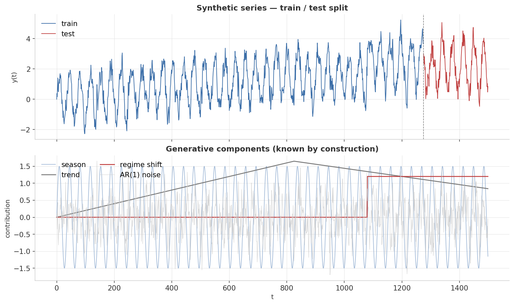
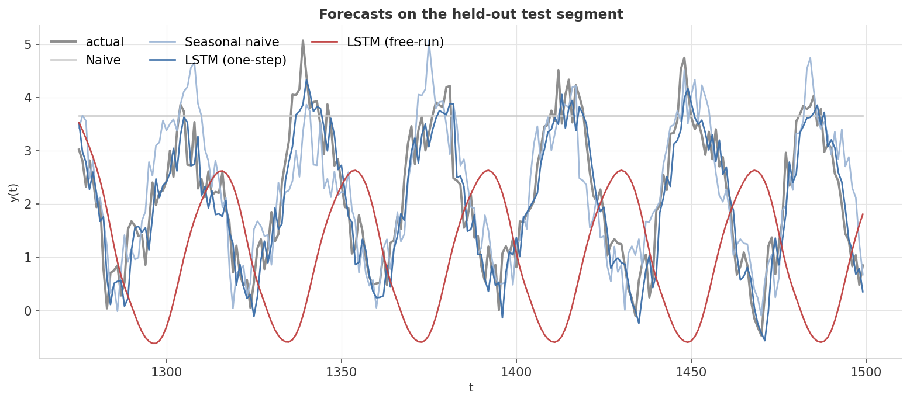
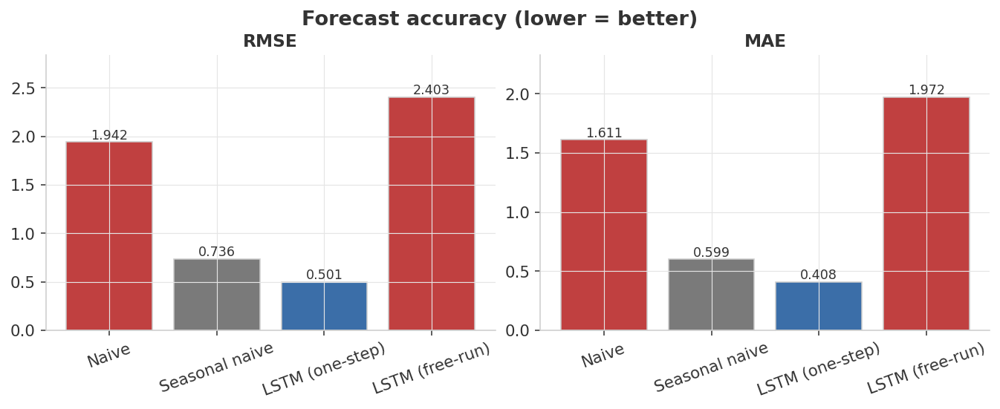
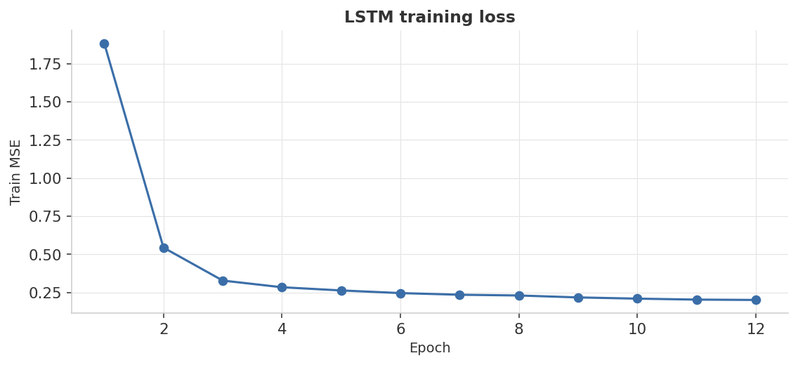

<div align="center">

# LSTM Time-Series Forecasting — and Why Multi-Step is Hard

**Forecast a synthetic series with a known generative process. Compare LSTM (one-step + free-run) against naive baselines.**


</div>

---

<p align="center">
  <a href="https://linnps.github.io/ml-06-rnn-lstm-timeseries/"></a>
</p>

## At a glance

> Build a time series from known parts — sinusoidal seasonality, piecewise-linear trend, AR(1) noise, one regime shift — and forecast the held-out tail four ways: naive, seasonal naive, LSTM with fresh context at every step, and LSTM running free on its own predictions.

<p align="center">
  
  
  
</p>
<p align="center"><sub>LSTM one-step (blue) beats both baselines &nbsp;·&nbsp; Seasonal naive (gray) = the competitive floor &nbsp;·&nbsp; LSTM free-run (red) loses to seasonal naive — error compounds over 225 steps</sub></p>

<sub>**Headline finding:** the same LSTM is *the best* and *the worst* method here, depending on how you ask it to forecast. With actual history at every step it cleanly beats both naive baselines. Asked to roll forward 225 steps on its own predictions, the small per-step errors compound into a forecast that drifts off in completely the wrong direction. This split is the single most underappreciated thing about deep-learning forecasting.</sub>

---

## Experimental setup

Everything below is fixed by `seed = 42` and reproduces on any machine with the pinned library versions.

### Data-generating process

The series is fully synthetic — a sum of four known components (`generate_data.py`):

```
y(t) = season(t) + trend(t) + noise(t) + regime(t)
```

1. **Seasonality.** A sinusoid with period 36 steps and amplitude 1.5: `season(t) = 1.5 · sin(2π t / 36)`.
2. **Piecewise-linear trend.** Ramps up with slope `+0.002` per step until step 825 (55 % of 1 500), then reverses at slope `−0.0012` per step for the remainder.
3. **AR(1) noise.** An autoregressive noise process: `noise[t] = 0.55 · noise[t−1] + ε`, where `ε ~ 𝒩(0, 0.4²)`. The φ = 0.55 correlation makes the noise smoother than pure white noise — nearby residuals are similar, just like in real economic or sensor data.
4. **Regime shift.** A permanent level jump of +1.2 added to every step from step 1 080 (72 % of 1 500) onward. This tests whether the LSTM can adapt to a structural break it has never seen during training.

| Parameter | Value | Why it's set this way |
|---|---|---|
| `n_steps` | 1 500 | Long enough for ~41 full seasonal cycles; gives the LSTM many training windows. |
| `season_period` | 36 | Matches the lookback window (72 steps = 2 cycles) so the model always sees at least two complete periods. |
| `season_amp` | 1.5 | Amplitude comparable to the noise σ = 0.4 — the seasonal signal dominates but noise is non-trivial. |
| `trend_slope` | 0.002 | Slow drift relative to amplitude; visible but not overwhelming over 1 500 steps. |
| `trend_break_at` | 0.55 | Slope flip occurs at step 825 — well inside the training region (85 % = step 1 275). |
| `ar1_phi` | 0.55 | Moderate autocorrelation; correlated errors are harder for window models than i.i.d. noise. |
| `ar1_sigma` | 0.4 | Sets the irreducible error floor. The LSTM cannot beat σ ≈ 0.4 on one-step MAE by construction. |
| `regime_shift_at` | 0.72 | Shift at step 1 080 — inside training, so the LSTM sees it once; test starts at step 1 275 after the shift. |
| `regime_shift_size` | 1.2 | Level jump ~3× the noise σ; large enough to disrupt naive forecasters. |
| `seed` | 42 | Drives the RNG for AR(1) noise generation; also passed to `torch.manual_seed` for weight initialization. |

### Windowing / sequence construction

The LSTM is trained on a **sliding-window** dataset built from the training portion of the series:

- **Lookback window:** `window = season_period × 2 = 72` steps — two full seasonal cycles of context.
- **Horizon:** 1 step (next value `y[t]`).
- **Stride:** 1 step (every possible window is used — dense overlap).
- **Construction:** `make_windows(y, 72)` iterates `i = 72 … len(y_train)−1`, producing input `y[i−72 : i]` and target `y[i]`. The training set of 1 275 steps produces **1 203 (window, target) pairs**.

### Preprocessing / scaling

**No explicit scaling is applied in this codebase.** The raw `float64` values from the generator are cast to `torch.float32` and fed directly into the LSTM. This works here because all four components are designed to keep `y(t)` in a moderate numeric range (roughly −2 to +5 over 1 500 steps), and PyTorch's default weight initialization tolerates this. On real data with large magnitude or units variability, fitting a `MinMaxScaler` or `StandardScaler` on the training fold only before windowing would be standard practice.

### Train / test split

The series is split **chronologically** — no shuffling of the time axis:

- **Split point:** step 1 275 (85 % of 1 500), computed as `int(0.85 × 1500)`.
- **Train:** steps 0 – 1 274 (1 275 values). The training windows are shuffled within `DataLoader` (standard mini-batch SGD), but the split itself is strictly temporal.
- **Test:** steps 1 275 – 1 499 (**225 values**). No training information crosses the split boundary.

### Model architecture

| Component | Specification |
|---|---|
| Architecture | Single-layer LSTM |
| Input size | 1 (univariate series, each timestep is a scalar) |
| Hidden size | 32 units |
| Layers | 1 |
| Output head | `Linear(32 → 1)` — reads the last hidden state only |
| Parameters | ~4 500 (tiny by design) |

### Training hyperparameters

| Hyperparameter | Value | Why |
|---|---|---|
| Optimizer | Adam | Adaptive step sizes converge faster than SGD on LSTMs without tuning a schedule. |
| Learning rate | 5 × 10⁻³ | Aggressive enough to converge in 12 epochs; the loss curve shows a clean plateau. |
| Batch size | 64 | Small enough to keep GPU utilization high on 1 203 samples; large enough for stable gradient estimates. |
| Epochs | 12 | Training MSE plateaus at ~0.20 by epoch 10–12, matching the AR(1) noise variance (~0.16 = σ² = 0.4²). |
| Loss | MSE (`F.mse_loss`) | Standard one-step regression loss; equivalent to maximizing Gaussian likelihood. |

### Environment

`python ≥ 3.10` · `numpy ≥ 1.24` · `pandas ≥ 2.0` · `matplotlib ≥ 3.7` · `torch ≥ 2.0`

---

## Dashboard

### Forecast scorecard

<table>
<tr><th align="left">Method</th><th>RMSE</th><th>MAE</th></tr>
<tr>
  <td><b>Naive</b> <sub>(last value)</sub></td>
  <td align="center"></td>
  <td align="center"></td>
</tr>
<tr>
  <td><b>Seasonal naive</b> <sub>(period = 36)</sub></td>
  <td align="center"></td>
  <td align="center"></td>
</tr>
<tr>
  <td><b>LSTM (one-step)</b></td>
  <td align="center"></td>
  <td align="center"></td>
</tr>
<tr>
  <td><b>LSTM (free-run)</b></td>
  <td align="center"></td>
  <td align="center"></td>
</tr>
</table>

<sub>Lower is better &nbsp;·&nbsp; Blue = best in column (LSTM one-step) &nbsp;·&nbsp; Red = worst (Naive RMSE / LSTM free-run) &nbsp;·&nbsp; Honest finding: free-run RMSE 2.4033 is worse than seasonal naive 0.7364 — error compounds over 225 steps &nbsp;·&nbsp; values from <code>results/metrics.json</code></sub>

### 1. The series — and what's inside it



**Top**: the full 1500-step series, blue = train (85%), red = test (15%). The series clearly *looks* like one signal, but it isn't — it's a sum of four well-defined components, shown below.

**Bottom**: the four generative components plotted separately.

- The **light-blue sinusoid** is the seasonal cycle (period 36, amplitude 1.5).
- The **gray triangle** is the trend — a piecewise-linear ramp that flips slope around step 825.
- The **red step** is the regime shift at step 1080 (level jumps by +1.2).
- The **light-gray squiggle** is AR(1) noise (φ = 0.55, σ = 0.4).

Knowing the components by construction lets us reason about which methods *should* be able to capture which.

### 2. Forecasts on the test segment



Four lines on top of the actual (gray):

- **Naive (light gray)**: a flat line at the last training value. Misses everything.
- **Seasonal naive (light blue)**: copies the equivalent cycle from one season ago. Recovers the periodic pattern but misses the regime shift.
- **LSTM one-step (blue)**: tracks the actual series within the noise band — the closest curve to the gray.
- **LSTM free-run (red)**: starts plausibly but drifts off after a few cycles, settling into a phase-shifted oscillation that no longer matches reality.

The visual is the lesson: a deep model with fresh data is dominant; the same model on its own predictions is unreliable.

### 3. Forecast accuracy



RMSE and MAE both rank the methods identically: LSTM one-step < Seasonal naive < Naive ≈ LSTM free-run. The 4× gap between LSTM-one-step and LSTM-free-run on the same model is the practical takeaway.

### 4. Training dynamics



Training MSE drops cleanly from ~1.9 to ~0.2 over 12 epochs. The plateau around epoch 10–12 indicates the LSTM has captured the deterministic structure (seasonality + trend), and the residual training error is essentially the AR(1) noise variance — which is *un-forecastable* by construction.

---

## Validation methodology

### Metrics

All metrics are computed on the 225-step held-out test segment (steps 1 275 – 1 499):

| Metric | Definition | How to read it |
|---|---|---|
| **RMSE** | $\sqrt{\frac{1}{n}\sum_{i=1}^{n}(y_i - \hat{y}_i)^2}$ | Typical error in the units of `y`. Penalizes large misses more than MAE. Comparable to the noise floor: an LSTM at RMSE ≈ 0.4–0.5 has nearly saturated what is recoverable. |
| **MAE** | $\frac{1}{n}\sum_{i=1}^{n}\lvert y_i - \hat{y}_i \rvert$ | Median-ish error magnitude. Less sensitive to outliers. The LSTM at MAE 0.408 is essentially at the AR(1) σ = 0.4 floor. |

No MAPE is computed because `y(t)` passes through zero (due to the sinusoidal component), making percent errors undefined at certain timesteps.

### Forecast evaluation: one-step vs. multi-step

The LSTM is evaluated in **two distinct modes** — which is the core experimental design:

- **One-step (with fresh context):** at each test step `t`, the model receives the *actual* series values `y[t−72 : t]` as context and predicts `y[t]`. This is the fair evaluation for a deployed model that receives real data each tick.
- **Free-run (multi-step rollout):** the model is given actual history up to the split and then fed its *own predictions* as context for all 225 subsequent steps. This reveals error compounding under autoregressive feedback.

### Baseline comparisons

Two naive baselines are explicitly computed and compared:

| Baseline | Rule | Purpose |
|---|---|---|
| **Naive (persistence)** | $\hat{y}[t] = y[\text{train\_end}]$ | Absolute floor: a model that cannot beat "predict the last observed value" is useless. |
| **Seasonal naive** | $\hat{y}[t] = y[t - 36]$ | The relevant competitive baseline for any series with known seasonality. An ML model that loses to `y[t] = y[t−period]` adds no value. |

The LSTM one-step forecast (RMSE 0.501) beats seasonal naive (RMSE 0.736). The LSTM free-run (RMSE 2.403) does not — it is worse than both baselines, which is the intended lesson.

### Training dynamics and the noise floor

Training MSE starts at ~1.883 (epoch 1) and converges to ~0.201 (epoch 12). The theoretical minimum MSE for one-step prediction of an AR(1) process with σ = 0.4 is $\sigma^2 = 0.16$. The gap (0.201 vs 0.16) reflects residual seasonal and trend variance in the training windows that the model does not perfectly capture — not a failure mode, as the test one-step MAE of 0.408 ≈ σ confirms the model is close to optimal.

### Full results

| Method | Test RMSE | Test MAE |
|---|---:|---:|
| Naive (last value) | 1.9421 | 1.6108 |
| Seasonal naive | 0.7364 | 0.5995 |
| **LSTM (one-step)** | **0.5008** | **0.4081** |
| LSTM (free-run) | 2.4033 | 1.9716 |

<sub>Exact values from `results/metrics.json`, regenerated on every `python train.py`. Bold = best in column.</sub>

### Reproducibility

`seed = 42` is passed to `numpy.random.default_rng` for data generation and to `torch.manual_seed` before weight initialization. This makes data, weight draws, and mini-batch ordering deterministic, so the numbers above reproduce exactly given the pinned `torch ≥ 2.0` version. Note: GPU execution with cuDNN may produce slightly different floating-point results due to non-deterministic kernel selection.

---

## What's actually happening

### The generative process — fully under our control

```
y(t) = season(t) + trend(t) + ar1_noise(t) + regime_shift(t)
```

By construction, the irreducible part of the series is the AR(1) noise — even an oracle can't predict that better than its conditional mean. So the *theoretically optimal* one-step RMSE on this series is roughly the AR(1) standard deviation σ ≈ 0.4. The LSTM at 0.408 MAE is essentially at that floor.

### Why the LSTM beats seasonal naive at one-step

Seasonal naive copies y[t−36]. It captures seasonality perfectly but is blind to the trend slope flip and the regime shift, both of which produce systematic errors. The LSTM, with its 72-step context window (two full cycles), can pick up the trend direction and respond to the level shift after seeing it once. That's where the 0.501 vs 0.736 gap comes from.

### Why the same LSTM fails on free-run

Multi-step rollout = autoregressive feedback. At each step, the LSTM uses its previous prediction as input for the next prediction. Two compounding effects make this break down:

1. **Distribution shift**: the model was trained on inputs sampled from the *true* series distribution. Its own predictions, slightly off in many small ways, slowly leave that distribution and enter territory the model wasn't trained on.
2. **Errors compound multiplicatively**: a +5% error on step 1, propagated through 225 steps, can blow up.

This is why production forecasting systems either re-condition on fresh data frequently, or are explicitly trained on multi-step prediction (e.g., teacher forcing during training, but evaluated on rollout — or sequence-to-sequence architectures that *output* the whole horizon at once).

### Mental model

| You have… | Use |
|---|---|
| **One-step ahead** prediction with fresh data each tick | LSTM (or a small MLP on lagged features — often equally good) |
| **Multi-step horizon** with no new data | Seasonal naive + structural model (Prophet, ETS), then add ML on residuals |
| **Strong known seasonality** | Seasonal naive is hard to beat; treat it as the floor your model must exceed |
| **Need uncertainty bands** | Stick to statistical methods (ARIMA / state-space) — LSTMs don't natively give intervals |

---

## Reproduce

```bash
python3 -m venv .venv && source .venv/bin/activate
pip install -r requirements.txt
python generate_data.py
python train.py
```

Total wall-time: under 30 seconds on CPU. The model is intentionally tiny (1-layer, 32-hidden LSTM) — bumping it to 2-layer 64-hidden makes the training curves prettier but doesn't move test RMSE much, because the irreducible noise is the binding constraint.

### Tweak the difficulty

`DataConfig` in [`generate_data.py`](generate_data.py):

```python
DataConfig(
    n_steps=1500,
    season_period=36,
    season_amp=1.5,
    trend_slope=0.002,
    trend_break_at=0.55,        # where slope flips sign
    ar1_phi=0.55, ar1_sigma=0.4,
    regime_shift_at=0.72,
    regime_shift_size=1.2,
    seed=42,
)
```

Crank `ar1_sigma` up to 1.5 to make the noise drown the signal, or set `season_period=240` to test how well a 72-step context window can still pick up a 240-step cycle (it can't — that's a context-window failure mode).

---

## Project layout

```
06-rnn-lstm-timeseries/
├── README.md              ← this dashboard
├── requirements.txt
├── generate_data.py       ← deterministic time-series generator
├── train.py               ← LSTM + baselines + dashboard figures
├── assets/                ← 4 dashboard PNGs
└── results/metrics.json
```

---

## Notes on methodology & limitations

Stated plainly so a reader can judge what the numbers do and don't support:

- **Synthetic series with known structure is a best-case scenario.** All four components (seasonality, trend, regime shift, AR(1) noise) are well-behaved and stationary within each regime. Real-world series typically contain irregular structural breaks, missing data, non-stationary volatility, and calendar effects that a small 1-layer LSTM would handle much worse. The RMSE 0.501 should not be extrapolated to production expectations.
- **No scaling is applied.** For this particular series the raw value range is benign, but a leak-free pipeline would fit a `MinMaxScaler` or `StandardScaler` on the training fold only and apply it to both the training windows and test windows. Fitting on the full series (including test) would leak future statistics into training, inflating apparent performance.
- **The chronological split is respected, but only one split is evaluated.** A single 85/15 train/test split is sufficient to demonstrate the one-step vs. free-run contrast; it is not sufficient to produce a statistically reliable RMSE estimate. Metrics could shift noticeably with a different split point (e.g., 75/25) or a different seed. The robust finding is the *direction* of the comparison (LSTM one-step > seasonal naive; free-run degrades severely), not the exact third-decimal values.
- **One-step forecasting only.** The model is trained and evaluated on predicting `y[t+1]` given the previous 72 steps. There is no direct-multi-step output or a sequence-to-sequence horizon. The "free-run rollout" is not a trained multi-step model — it is an inference-time workaround that illustrates error compounding. A purpose-built sequence-to-sequence or NBEATS model would fare better.
- **No hyperparameter search.** Architecture (32 hidden units, 1 layer) and training configuration (lr = 5×10⁻³, batch = 64, epochs = 12) are fixed illustrative values, not cross-validated optima. The plateau in training MSE suggests the current configuration is not underfitting, but a larger or deeper LSTM might modestly lower one-step RMSE — though the AR(1) noise floor (σ ≈ 0.4) limits the upside.

---

## What I learned

- **Always benchmark against seasonal naive.** It is criminally underrated. On any series with strong seasonality, getting beaten by `y[t] = y[t−period]` is a real risk for ML methods, and it's the *first* baseline I should try before reaching for an LSTM.
- **One-step accuracy and multi-step accuracy are different metrics.** Reporting one without the other is misleading. The LSTM here gets +4% better than seasonal naive on one-step *and* 3× worse on a 225-step rollout. Both are true; both matter.
- **The irreducible-noise floor is real.** When training MSE plateaus at ~σ² of the noise process you injected, the model has *learned the deterministic part of the data and nothing more is recoverable*. That's success, not failure.
- **Multi-step rollout is a property of how you *use* the model, not the model itself.** A bigger LSTM doesn't fix free-running drift. The fix is architectural (sequence-to-sequence) or procedural (re-condition on real data when it arrives).

---

<div align="center">
<sub>Part of a hands-on machine-learning portfolio. Data is fully synthetic and self-generated.</sub>
</div>
